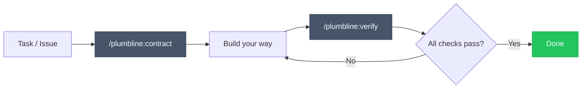

# Plumbline

**Generating is easy. Verifying is the work.**

AI can produce code, content, and analysis faster than ever. The bottleneck has shifted. The hard problem is no longer generation — it's knowing whether what was generated is correct, complete, and ready for production.

Plumbline is verification infrastructure. It generates **verification contracts** — structured, executable criteria that define what "done" means — and verifies the result against them.

## How it works

Two phases. One before you build, one after.



### 1. Contract — define what success looks like

```
/plumbline:contract
```

Plumbline analyzes your project — docs, codebase, conventions, linked issues — and produces a verification contract. Every check is tagged `[auto]` or `[manual]`:

- **`[auto]`** checks are executable by agents — shell commands, structural analysis, content measurement. Tool output is evidence.
- **`[manual]`** checks require human judgment and include inline rubrics (1–4 scale) so evaluation is consistent, not a subjective yes/no.

```markdown
## Functional Verification
- [ ] `[auto]` POST /auth/login returns 200 with valid credentials
- [ ] `[auto]` Rate limiting activates after 5 failed attempts

## Craft Verification
- [ ] `[auto]` Auth logic lives in service layer, not in route handler
  <!-- verify: grep -c "bcrypt\|jwt\|sign\|verify" src/routes/auth.ts
       — must be 0; all crypto belongs in src/services/ -->
- [ ] `[manual]` Naming follows existing codebase conventions
  <!-- rubric:
  4: All new symbols match naming patterns in adjacent files
  3: Consistent casing, minor stylistic deviation
  2: Some symbols use inconsistent casing
  1: Multiple naming convention violations
  threshold: 3
  -->

## Contextual Verification
- [ ] `[auto]` All existing tests still pass
- [ ] `[manual]` Error messages don't leak internal details
```

### 2. Verify — check whether you got there

```
/plumbline:verify
```

Plumbline executes every auto check, walks you through manual checks with their rubrics, and produces a verification report with evidence for every result:

```markdown
## Verification Report

✓ POST /auth/login returns 200 with valid credentials
✓ Rate limiting activates after 5 failed attempts
✗ Auth logic lives in service layer, not in route handler
  Evidence: grep found 3 matches for jwt.sign in src/routes/auth.ts
✓ Naming follows existing codebase conventions — Score: 3/4 (threshold: 3)
✓ All existing tests still pass
```

When something fails, you know exactly what and why. Fix it and run verify again.

## Three verification dimensions

| Dimension | Question it answers |
|-----------|-------------------|
| **Functional** | Does it do what it's supposed to do? |
| **Craft** | How well is it done? |
| **Contextual** | Does it work in the real system? |

Most tools stop at functional. Plumbline doesn't.

## Not just code

Plumbline is domain-agnostic. The contract format works for anything with verifiable criteria — API implementations, incident postmortems, documentation, blog posts. The [`examples/`](examples/) directory includes both a [software contract](examples/software-api-contract.md) and an [incident postmortem contract](examples/incident-postmortem-contract.md).

## Where it fits

| Phase | Tools | Role |
|-------|-------|------|
| Plan | Issues, specs | Define the *what* |
| Build | Cursor, Copilot, Claude Code, by hand | Build the *how* |
| **Verify** | **Plumbline** | **Audit that the *how* meets the *what*** |
| Ship | CI/CD, code review | Deliver |

Plumbline does not replace your existing tools — TDD, linters, code review, CI/CD, or any AI coding assistant. Those tools help you build. Plumbline helps you decide whether what you built is right.

## Limitations

**The contract is only as good as its review.** Plumbline generates the contract, but you approve it. If the contract misses a criterion, verification will miss it too. The human is the final authority on what "done" means — Plumbline gives you a structured place to define it.

**Auto checks are deterministic; manual checks are not.** Auto checks produce the same result every time. Manual checks depend on human judgment, which is why they include rubrics — to make that judgment consistent and auditable, not to eliminate subjectivity.

**External domain knowledge is not automatic.** When a task depends on real-world constraints (opening hours, API rate limits, regulations), the contract skill uses web search to discover them. This is probabilistic — it may miss constraints that don't surface in search results. For high-stakes domain-dependent tasks, independent domain expert review is recommended.

**This is a developer tool, not a CI gate.** Plumbline runs in your local agent environment (currently Claude Code). It's designed to increase confidence before you commit, not to replace your test suite in a pipeline.

## Install

In [Claude Code](https://claude.ai/claude-code):

```
/plugin marketplace add EmilioCarrion/plumbline
/plugin install plumbline@plumbline
```

## Design Principles

- **Criteria, not code** — generates verification criteria, never implementation
- **Domain-agnostic** — works for software, content, analysis, or any AI-assisted task
- **Agent + human** — maximizes automated verification, accepts human judgment where needed
- **Zero infrastructure** — all state is Markdown files. No database, no server, no config
- **Workflow-independent** — use any process between contract and verify

## Philosophy

The future of engineering isn't writing more code. It's building better systems to decide what code is correct.

[Read the full rationale.](https://www.emiliocarrion.com/en/blog/generating-easy-verifying-work)

## License

MIT
