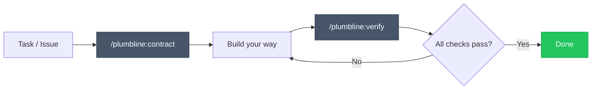

# Plumbline

**Generating is easy. Verifying is the work.**

Plumbline is verification infrastructure for AI-assisted work. It generates **verification contracts** — structured, executable criteria that define what "done" actually means — and then verifies the result against them.

In a world where AI can produce code, content, and analysis faster than ever, the bottleneck has shifted. The hard problem is no longer *generation*. It's knowing whether what was generated is correct, complete, and ready for production.

Plumbline closes that gap.

## How it works

Two phases. One before you build, one after.



### 1. Contract — define what success looks like

```
/plumbline:contract
```

Plumbline analyzes your project — docs, codebase, conventions, linked issues — asks targeted questions to fill gaps, and produces a verification contract:

```markdown
## Functional Verification
- [ ] `[auto]` POST /auth/login returns 200 with valid credentials
- [ ] `[auto]` Rate limiting activates after 5 failed attempts
- [ ] `[manual]` Error messages don't leak internal details

## Craft Verification
- [ ] `[auto]` Auth logic lives in service layer, not in route handler
- [ ] `[auto]` First mention of the new module appears after the architectural context is established
- [ ] `[manual]` Naming follows existing codebase conventions
  <!-- rubric:
  4: All new symbols match naming patterns in adjacent files
  3: Consistent casing, minor stylistic deviation
  2: Some symbols use inconsistent casing
  1: Multiple naming convention violations
  threshold: 3
  -->

## Contextual Verification
- [ ] `[auto]` All existing tests still pass
- [ ] `[manual]` Latency impact assessed for auth middleware in hot path
```

Every check is tagged `[auto]` (executable by agents) or `[manual]` (requires human judgment). Auto checks include execution hints — from shell commands to structural analysis that agents verify with tools. Manual checks include inline rubrics with a 1-4 scale, so evaluation is consistent and actionable rather than a subjective yes/no.

### 2. Verify — check whether you got there

```
/plumbline:verify
```

Plumbline reads the contract, executes every auto check, walks you through manual checks, and produces a verification report with evidence for every pass and fail.

## Three verification dimensions

| Dimension | Question it answers |
|-----------|-------------------|
| **Functional** | Does it do what it's supposed to do? |
| **Craft** | How well is it done? |
| **Contextual** | Does it work in the real system? |

Most tools stop at functional. Plumbline doesn't.

## Install

In [Claude Code](https://claude.ai/claude-code):

```
/plugin marketplace add EmilioCarrion/plumbline
/plugin install plumbline@plumbline
```

## What Plumbline is not

Plumbline does not replace your existing tools — TDD, linters, code review, CI/CD, or any AI coding assistant. It complements them. Those tools help you *build*. Plumbline helps you *decide whether what you built is right*.

Think of it as an independent verification layer that sits above your workflow, not inside it.

## Design Principles

- **Criteria, not code** — generates verification criteria, never implementation
- **Domain-agnostic** — works for software, content, analysis, or any AI-assisted task
- **Agent + human** — maximizes automated verification, accepts manual checks where needed
- **Zero infrastructure** — all state is Markdown files. No database, no server, no config
- **Workflow-independent** — use any process between contract and verify. Plumbline doesn't care how you build, only what you built

## Philosophy

The future of engineering isn't writing more code. It's building better systems to decide what code is correct.

[Read the full rationale.](https://www.emiliocarrion.com/en/blog/generating-easy-verifying-work)

## License

MIT
